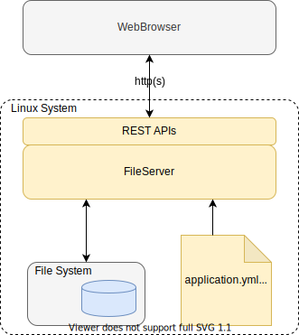

[](https://opensource.org/licenses/Apache-2.0)
[](https://travis-ci.org/jveverka/file-server)

# FileServer 
This FileServer makes specified *base directory* accessible via REST APIs allowing you 
to list, download, upload, move and delete files and create empty directories. It also provides 
user access control and security.



## Features implemented
* Standalone java server, running on linux system.
* Runs on the top of file system of host server.
* Provides access via REST APIs to the file system.
* File system operations supported
  - list / read content of the directory
  - download file, upload file
  - create empty directory
  - delete file or directory
  - move file or directory
  - get audit data for resource (file or directory) like number of downloads, uploads, ...
* Uses Role based access control 
* Supports multi-tenancy (many users and roles)
* Access for anonymous users (user not logged in) 
* Privileged admin role for server setup and monitoring
* Transport protocols: http or https
* Single jar distribution (~16MB).  
* Admin APIs for monitoring and management access and users/roles.
* Audit APIs for admin, to check activities on server.
* Server setup is stored in memory or on file system.

## Planned features
* web UI / web client for REST APIs
* compressed directory download
* compressed directory upload

## Configurations
FileServer may be configured in several distinct ways. Check
[configurations examples](docs/Configurations.md) chapter for more examples.

## Requirements for developers
* [JDK 11](https://jdk.java.net/11/) or later (JDK 8 is supported as well)
* [Gradle 5.0](https://gradle.org/next-steps/?version=5.0&format=bin) or later

## Runtime requirements
* [JDK 11](https://jdk.java.net/11/) or later (JDK 8 is supported as well)
* Requires read/write access to *base directory* on local file system.

### Rest Endpoints
All REST endpoints use 'dynamic' path. This means that path ``**`` is used as relative path in *base directory*.
See also [postman collection example](docs/FileServer.postman_collection.json).

#### Get list of files  
* __GET__ http://localhost:8888/services/files/list/** - list content directory or subdirectory  
  ``curl -X GET http://localhost:8888/services/files/list/ -b /tmp/cookies.txt``

#### Download file  
* __GET__ http://localhost:8888/services/files/download/** - download file on path. file must exist.   
  ``curl -X GET http://localhost:8888/services/files/download/path/to/001-data.txt -b /tmp/cookies.txt``

#### Upload file
* __POST__ http://localhost:8888/services/files/upload/** - upload file, parent directory(ies) must exist before upload  
 ``curl -F 'file=@/local/path/to/file.txt' http://localhost:8888/services/files/upload/path/to/001-data.txt -b /tmp/cookies.txt``

#### Delete files and/or directories
* __DELETE__ http://localhost:8888/services/files/delete/** - delete file or directory  
  ``curl -X DELETE http://localhost:8888/services/files/delete/path/to/001-data.txt -b /tmp/cookies.txt``

#### Create empty directory
* __POST__ http://localhost:8888/services/files/createdir/** - create empty directory  
  ``curl -X POST http://localhost:8888/services/files/createdir/path/to/directory -b /tmp/cookies.txt``

#### Move file or directory
* __POST__ http://localhost:8888/services/files/move/** - move file or directory. If source is file, destination must be also a file, If source is directory, destination must be directory as well.
  ``curl -X POST http://localhost:8888/services/files/move/path/to/source -b /tmp/cookies.txt -d '{ "destinationPath": "path/to/destination" }''``

#### Get audit data
* __GET__ http://localhost:8888/services/files/audit/** - get audit data for the resource.
  ``curl -X POST http://localhost:8888/services/files/audit/path/to/source -b /tmp/cookies.txt``

### Security
In order to use file server REST endpoints above, user's http session must be authorized.
Users have defined their roles and access rights to files and directories. 
See this [example](src/main/resources/application.yml) of server configuration.

#### login
* __POST__ http://localhost:8888/services/auth/login  
  ``curl -X POST http://localhost:8888/services/auth/login -H "Content-Type: application/json" -d '{ "userName": "master", "password": "secret" }' -c /tmp/cookies.txt``

#### logout
* __GET__ http://localhost:8888/services/auth/logout  
  ``curl -X GET http://localhost:8888/services/auth/logout -b /tmp/cookies.txt``

### Admin access
Selected role ``fileserver.admin.role`` is used for admin access. Users with this role have access to special dedicated REST endpoints.
See this [example](src/main/resources/application.yml) of server configuration.
Refer to [attached postman collection](docs/FileServer.postman_collection.json) for all admin APIs.

#### Implemented admin features
* get volume information - base directory, used and free space
* get all open/active user sessions
* terminate selected user's session
* user management
  - get name of admin role
  - get name of anonymous role
  - list all users
  - create new user
  - remove user
* file access filter management
  - list all access filters
  - create new access filter
  - remove existing access filter
* audit data querying showing activities like:
  - login / logout events
  - file access events (download, upload, delete, ... all events are recorded)
  - user management events
  - file access filter management events  

### Build and Run
Variable ``file.server.home`` in ``application.yml`` file defines *base directory* to be exposed via REST APIs.
```
gradle clean build test
java -jar build/libs/file-server-1.0.1-SNAPSHOT.jar --spring.config.location=file:./src/main/resources/application.yml
```
